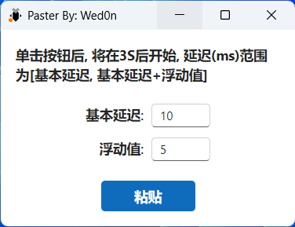
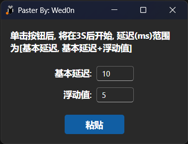

# Paster
一个帮助大家快乐粘贴的小程序。
## 注意事项
根据微软官方文档描述，当需要粘贴的程序以管理员身份运行时，本程序也需要以管理员身份运行。
> 此函数受 UIPI 约束。 仅允许应用程序将输入注入到完整性级别相等或更低级别的应用程序。
**SendInput** 函数将 [INPUT](https://learn.microsoft.com/zh-cn/windows/desktop/api/winuser/ns-winuser-input) 结构中的事件串行插入键盘或鼠标输入流。 这些事件不会与用户 (键盘或鼠标) 插入的其他键盘或鼠标输入事件，或者通过调用 [keybd_event](https://learn.microsoft.com/zh-cn/windows/desktop/api/winuser/nf-winuser-keybd_event)、 [mouse_event](https://learn.microsoft.com/zh-cn/windows/desktop/api/winuser/nf-winuser-mouse_event) 或 **对 SendInput** 的其他调用插入。
此函数不会重置键盘的当前状态。 调用函数时已按下的任何键都可能会干扰此函数生成的事件。 若要避免此问题，请使用 [GetAsyncKeyState](https://learn.microsoft.com/zh-cn/windows/desktop/api/winuser/nf-winuser-getasynckeystate) 函数检查键盘的状态，并根据需要进行更正。
由于触摸键盘使用 winnls.h 中定义的代理宏将输入发送到系统，因此键盘事件挂钩上的侦听器必须解码源自触摸键盘的输入。 有关详细信息，请参阅 [代理项和补充字符](https://learn.microsoft.com/zh-cn/windows/desktop/Intl/surrogates-and-supplementary-characters)。
辅助功能应用程序可以使用 **SendInput** 注入与 shell 处理的应用程序启动快捷键对应的击键。 此功能不保证适用于其他类型的应用程序。
## 编译

### 前置要求
- Node.js (推荐 v18+)
- Rust (推荐使用 [rustup](https://rustup.rs/) 安装)
- pnpm (可通过 `npm install -g pnpm` 安装)

### 构建步骤

1. **安装前端依赖**
```bash
pnpm install
```

2. **构建前端**
```bash
pnpm build
```

3. **安装 Tauri CLI v1**（本项目使用 Tauri v1.5）
```bash
cargo install tauri-cli --version "^1.0" --locked
```

4. **构建桌面应用**
```bash
cargo tauri build
```

### 构建产物

构建完成后，会在 `src-tauri/target/release/` 目录下生成：

- **独立 EXE 文件**：`paster.exe`（可直接运行，无需安装）
- **MSI 安装包**：`bundle/msi/paster_0.1.4_x64_en-US.msi`
- **NSIS 安装包**：`bundle/nsis/paster_0.1.4_x64-setup.exe`

### 开发模式

如果需要开发调试，可以运行：
```bash
# 前端开发服务器
pnpm dev

# 另一个终端运行 Tauri 开发模式
cargo tauri dev
```

### 仅构建 EXE（不生成安装包）

```bash
cargo build --release
# 生成的 exe 位于：src-tauri/target/release/paster.exe
```
## 截图
<div align="center">
  
  
</div>